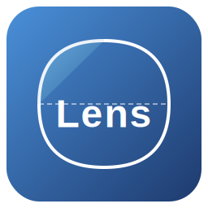

# AutoCAD Lens Package 🥽

**镜片AutoCAD绘图工具包** — 用于在 AutoCAD 中快速绘制镜片截面图，支持多镜片参数配置、参数同步、公差标注等特性。



---

## 功能特性

- ✅ **批量绘制** — 支持同时绘制最多 3 个镜片，自动排列位置
- ✅ **参数同步** — 半径参数、厚度公差、中心厚度可一键同步
- ✅ **智能公差** — 矢高公差自动继承与补全
- ✅ **AutoCAD 集成** — 自动连接 AutoCAD，支持模板加载和打印设置
- ✅ **图形化界面** — 基于 tkinter 的直观参数输入 GUI
- ✅ **数据持久化** — 自动保存/恢复上次输入的参数

## 安装

### 1. 安装依赖

```bash
pip install pyautocad
```

### 2. 安装本包

```bash
# 从源码安装
pip install -e .

# 或直接构建安装
python setup.py install
```

## 使用方法

### 命令行启动 GUI

```bash
# 方式 1: 使用 entry point
lens-gui

# 方式 2: 直接运行模块
python -m lens_package.lens_gui
```

### 在代码中使用

```python
from lens_package import DrawLens, draw_multiple_lenses

# 定义镜片参数
params = [
    {
        "radius1": -28.11,
        "radius2": 28.0,
        "center_thickness": 5.0,
        "outer_diameter": 11.5,
        "base": APoint(0, 0),
        "sagitta1": -0.316,
        "sagitta2": None,  # 自动计算
    }
]

# 批量绘制
draw_multiple_lenses(params)

# 或手动控制
lens = DrawLens()
lens.draw_lens(params[0])
```

## 打包为可执行文件

使用 PyInstaller 可将本工具打包为独立的 `.exe` 文件（无需 Python 环境）：

```bash
# 安装 PyInstaller
pip install pyinstaller

# 使用构建脚本
python build_exe.py

# 或手动执行
pyinstaller lens_exe.spec
```

生成的可执行文件位于 `dist/Lens/` 目录下，图标为 Lens 风格图标。

## 项目结构

```
autocad-python/
├── lens_package/           # 主包
│   ├── __init__.py         # 包入口
│   ├── draw_lens.py        # 镜片绘制核心逻辑
│   ├── lens_gui.py         # 图形化界面
│   ├── lens_gui_data.json  # GUI 数据存储
│   ├── params_storage.json # 参数存储
│   ├── utils/              # 工具模块
│   │   ├── layer.py        # 图层管理
│   │   ├── hatch.py        # 剖面线填充
│   │   ├── retry.py        # 重试机制
│   │   ├── scale_select.py # 标注比例选择
│   │   └── retry_decorator.py # 重试装饰器
│   ├── dimension/          # 标注模块
│   │   ├── __init__.py
│   │   └── dia.py          # 直径标注
│   ├── calculator/         # 计算模块
│   │   ├── __init__.py
│   │   ├── sagitta.py      # 矢高计算
│   │   └── arc_angle.py    # 弧角计算
│   └── icons/
│       └── Lens.svg        # Lens 图标
├── pyproject.toml          # 项目配置
├── setup.py                # 安装脚本
├── requirements.txt        # 依赖清单
├── build_exe.py            # EXE 构建脚本
├── lens_exe.spec           # PyInstaller spec
├── MANIFEST.in             # 清单文件
├── README.md               # 本文件
└── LICENSE                 # 许可证
```

## 许可证

MIT License © 2026 AutoCAD Lens Package Contributors
